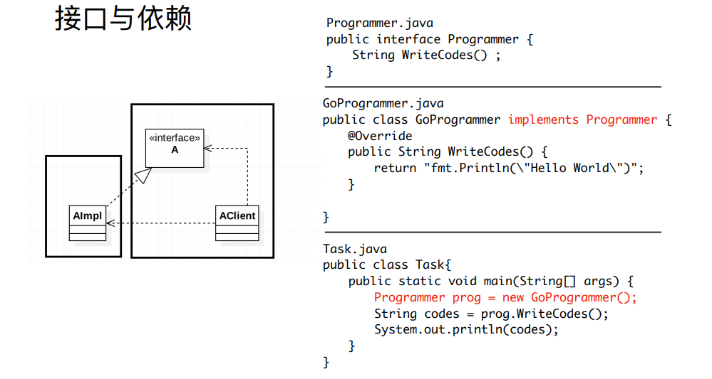
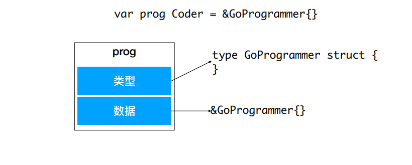

# Go语言相关接口  

## 定义交互协议

### 接⼝与依赖




### Duck Type 式接⼝实现

```Go
// 接⼝定义
type Programmer interface {
    WriteHelloWorld() Code
}

// 接⼝实现
type GoProgrammer struct {
}
func (p *GoProgrammer) WriteHelloWorld() Code {
    return "fmt.Println(\"Hello World!\")"
}
```
[代码地址](../code/go_learning/src/ch11/interface/interface_test.go)

### Go 接⼝

与其他主要编程语⾔的差异  
1. 接⼝为⾮⼊侵性，实现不依赖于借⼝定义
2. 所以接⼝的定义可以包含在接⼝使⽤者包内

### 接口变量



### ⾃定义类型

1. type IntConvertionFn func(n int) int
2. type MyPoint int