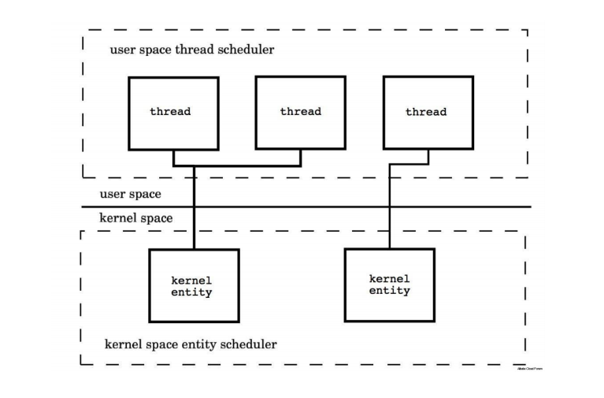
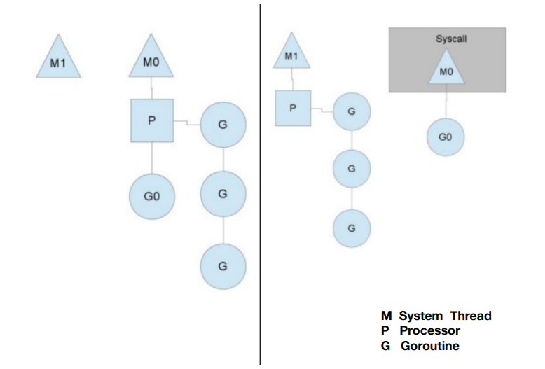

# 协程机制

### Thead vs. Groutine  

1. 创建时默认的 stack 的⼤⼩
   * JDK5 以后 Java Thread stack 默认为1M
   * Groutine 的 Stack 初始化⼤⼩为2K
2. 和 KSE （Kernel Space Entity) 的对应关系
   * Java Thread 是 1:1
   * Groutine 是 M:N

[代码地址](../code/go_learning/src/ch16/groutine/groutine_test.go)

