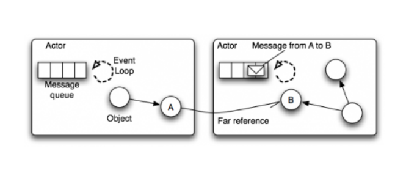
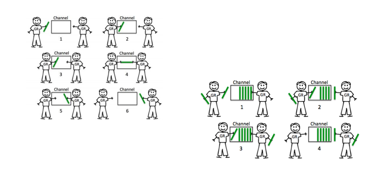

# CSP 并发机制

### Actor Model



### CSP vs. Actor

* 和Actor的直接通讯不同，CSP模式则是通过Channel进⾏通讯的，更松耦合⼀
些。
* Go中channel是有容量限制并且独⽴于处理Groutine，⽽如Erlang，Actor模式
中的mailbox容量是⽆限的，接收进程也总是被动地处理消息。

### Channel



[代码地址](../code/go_learning/src/ch17/share_mem/share_mem_test.go)

## 多路选择和超时控制

### select

* 多渠道的选择
```Go
select {
    case ret := <-retCh1:
        t.Logf("result %s", ret)
    case ret := <-retCh2:
        t.Logf("result %s", ret)
    default:
        t.Error(“No one returned”)
}
```
* 超时控制
```Go
select {
case ret := <-retCh:
    t.Logf("result %s", ret)
case <-time.After(time.Second * 1):
    t.Error("time out")
}
```

## channel 的关闭和⼴播

### channel 的关闭

* 向关闭的 channel 发送数据，会导致 panic
* v, ok <-ch; ok 为 bool 值，true 表示正常接受，false 表示通道关闭
* 所有的 channel 接收者都会在 channel 关闭时，⽴刻从阻塞等待中返回且上述 ok 值为 false。这个⼴播机制常被利⽤，进⾏向多个订阅者同时发送信号。如：退出信号。

## 任务的取消