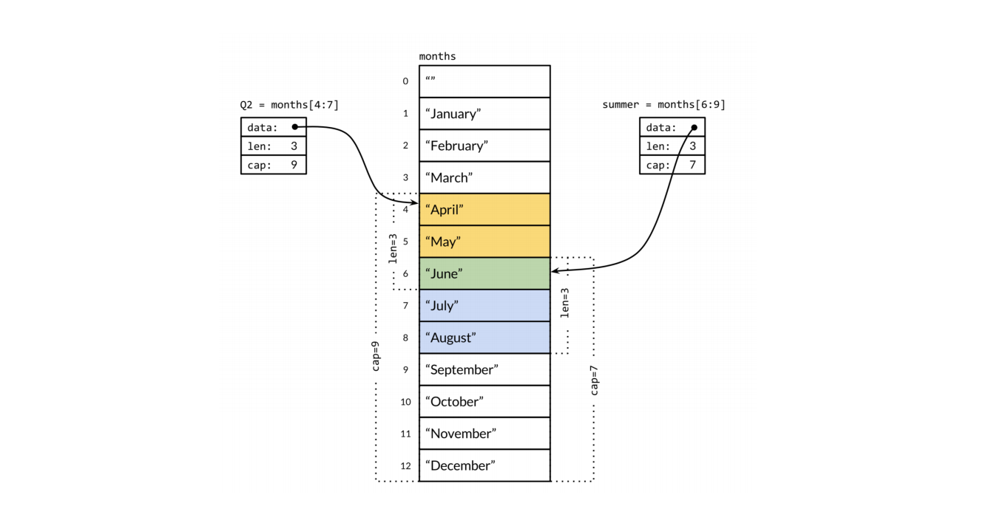

# 数组和切片

### 数组的声明

```Go
var a [3]int //声明并初始化为默认零值
a[0] = 1
b := [3]int{1, 2, 3} //声明同时初始化
c := [2][2]int{{1, 2}, {3, 4}} //多维数组初始化
```

### 数组元素遍历

与其他主要编程语⾔的差异
```Go
func TestTravelArray(t *testing.T) {
  a := [...]int{1, 2, 3, 4, 5} //不指定元素个数
  for idx/*索引*/, elem/*元素*/ := range a {
  fmt.Println(idx, elem)
 }
}
```

### 数组截取

a[开始索引(包含), 结束索引(不包含)]
```Go
a := [...]int{1, 2, 3, 4, 5}
a[1:2] //2
a[1:3] //2,3
a[1:len(a)] //2,3,4,5
a[1:] //2,3,4,5
a[:3] //1,2,3
```

### 切⽚内部结构


### 切⽚声明

```Go
var s0 []int
s0 = append(s0, 1)
s := []int{}
s1 := []int{1, 2, 3}
s2 := make([]int, 2, 4)
 /*[]type, len, cap
 其中len个元素会被初始化为默认零值，未初始化元素不可以访问
 */
```

### 切⽚共享存储结构



[代码地址](./../code/go_learning/src/ch6/slice_test/slice_test.go)

### 数组 vs. 切⽚
1. 容量是否可伸缩 数组不可以 切片可以
2. 是否可以进⾏⽐较 数组可以 切片之间不可以